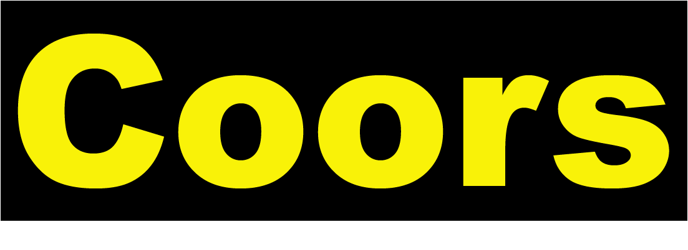

# Rainbow Coors: A Brand Mashup 

### Midterm Project

My website features the index page, about page, products page, locations page and a contact page, including a contact form. CSS3 Animation was used on the slogan in index.html. 

## Tools Used

To create the wireframes, Adobe Photoshop 2020 was used. Sublime Text was used to code all the pages in the project. 

## Requirements

You will only need a good browser to see the website. It was designed for Google Chrome with a 1920 x 1080 resolution, so using those would make it look best. 

## Installation

Clone the project, cd to your directory / download, and open the .html files in your browser.

## Author

1. HB (Haley Billson)

## License

MIT